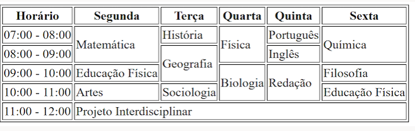

# 
 Trabalhando com tabelas 
Contruindo minha primeira tabela em html, usando algumas tags como table, th, tr e alguns 
parâmetros como colspan ou rowsopan.
Usando essa tabela de refrencia:

aaaaaaaaaaaaaaaaaaaaaaaaaaaaaa